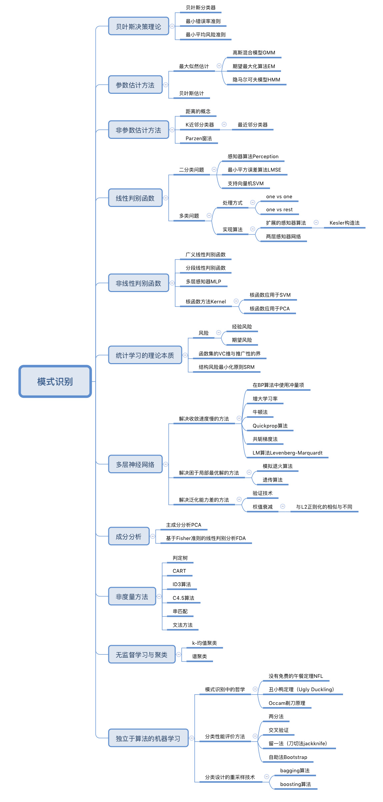

# hit-pattern-recognition-2018
哈工大模式识别课程实验
- 该课程一共有四个实验，分别三个普通实验，一个实验考试。
- 考试后我抽时间写了该课程的系列博客，[哈尔滨工业大学-模式识别-课程总结](https://www.cnblogs.com/szxspark/p/9915993.html)，只是写了几个重要课程内容，并加上我本人自学的一些见解。
- 写博客的时候顺便绘制了该课程的思维导图：
- 
